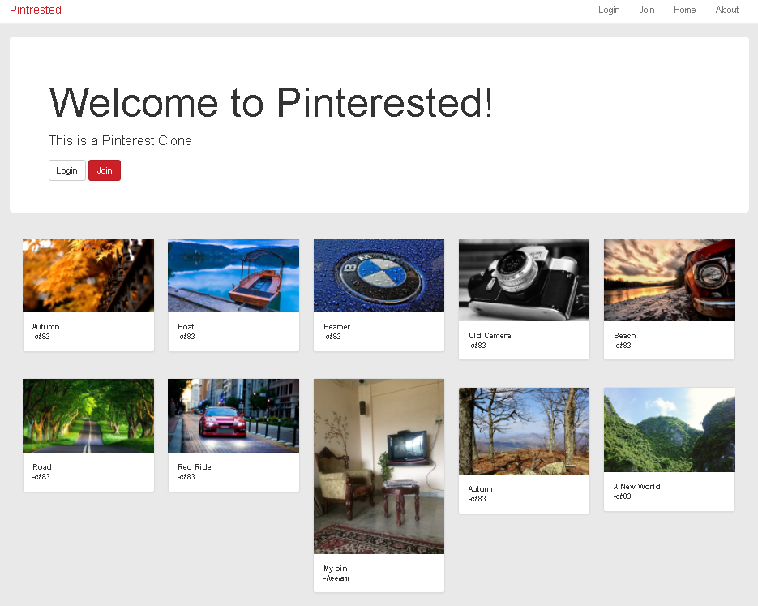

#[Pinterested](https://pinterested-ct83.herokuapp.com/)

[Live Demo](https://pinterested-ct83.herokuapp.com/)

<h4>Introduction</h4>
This website was made as a part of 'Ruby on Rails for Web Development Course on Udemy', this is a Pinterest clone made with Ruby on Rails.

<h4>Timeline</h4>
November 2017 - November 2017
  

<h4>Overview</h4>
The website was my introduction to Ruby on Rails, it is a clone of the popular website Pinterest. Clould9 IDE was used to make the App. The App was hosted on Heroku Servers in the free tier.

<h4>Tools</h4>
<ul>
<li>Cloud9 IDE</li>
<li>Heroku</li>
</ul>

<h4>Results</h4>
<ul>
<li>User can Signup, Login and Delete his account.</li>
<li>Registered Users are able to  <em>Upload Pins</em>, which other users are able to see.</li>
<li>All added <em>Pins</em> can be deleted only by the users who uploaded them.</li>
</ul>

<h4>Screenshots</h4>
<b>Pinterested</b>

<h4>Libraries</h4>
<ul>
  <li><a href="https://getbootstrap.com">BootStrap</a></li>
  <li><a href="https://github.com/thoughtbot/paperclip">Paperclip</a></li>
  <li><a href="https://github.com/plataformatec/devise">Devise</a></li>
</ul>

<b>tl;dr</b> [Live Demo](https://pinterested-ct83.herokuapp.com/)
